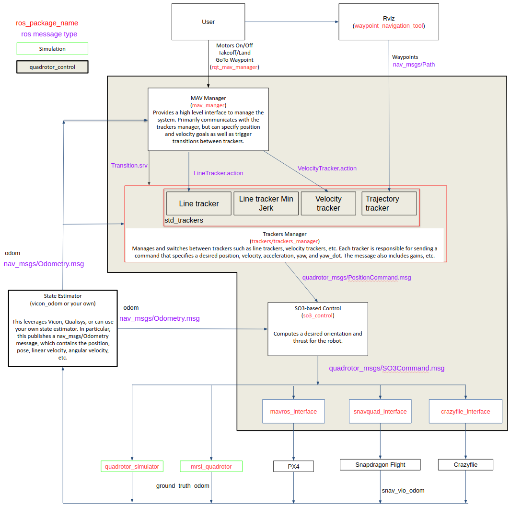

# hetro_swarm


# Snapdragon Flight Documentation/Interface
=================

These pages provide some information about the [Snapdragon Flight™](https://developer.qualcomm.com/hardware/snapdragon-flight) platform (developer’s edition) including how to setup the build environment, interface with quadrotor_control and more.

User Guides:
* [Tools & Resources](https://developer.qualcomm.com/software/qualcomm-navigator/tools)
* [Qualcomm Navigator User Guide (8x96)](https://developer.qualcomm.com/downloads/qualcomm-navigator-user-guide-8x96?referrer=node/34698)
    * Includes documentation for parameters in snav_params.xml.
* [Qualcomm Navigator Developer Guide v1.2.53.1](https://developer.qualcomm.com/download/qualcomm-flight/navigator-developer-guide-1.2.53.1.pdf?referrer=node/34698)
    * Includes documentation for low level Snapdragon Navigator API.
* [Guides on Intrinsyc](https://tech.intrinsyc.com/projects/snapdragon-flight/documents) - Needs Login.
* [Qualcomm Flight Debug Connector Pin-out and Hardware User Guide](https://developer.qualcomm.com/download/qualcomm-flight/qcflight-debug-connector-pin-out-hw-user-guide.pdf?referrer=node/30229)
* Common FAQs are addressed in the [forums](https://developer.qualcomm.com/forums/hardware/qualcomm-flight).
* Another resource on using the SDF can be found [here](https://docs.px4.cc/zh/flight_controller/snapdragon_flight.html).

Our board setup is slightly different than the [official documentation](https://github.com/ATLFlight/ATLFlightDocs). Following instructions have been pooled together from above guides, forums, etc.

We have three hardware platforms available in the lab for use.
* [Dragon Drone Development Kit](https://worldsway.com/product/dragon-drone-development-kit/) DDK. [Assembly Instructions](https://worldsway.com/wp-content/uploads/2017/08/DragonDDK-End-User-Assembly-Instructions_V3.pdf).
* Dragonfly
* Tiercel

## Board setup

[Snapdragon Flight](doc/SnapFlightSetup.md)

[VOXL Board](doc/VOXLSetup.md)

## Flying with the flight board and DDK (platform).

Run the script as sudo. This automatically restarts snav, launches necessary nodes. Enter `y` after snav restarts.
```
sudo -s
./tmux_snav.sh
```

There are helper scripts for ground station computer that sets up `ROS_MASTER_URI` and launches necessary nodes. This assumes `quadrotor_control`  and `snavquad_interface` is compiled in your laptop workspace. For example `dragonfly4` platform Enter the vehicle number accordingly.

```
roscd snavquad_interface/scripts
./tmux_ground_station 4
```

There are helper scripts for recording bag file in the `snavquad_interface/scripts/capture` folder. On the mav tmux session, switch to the `Aux` tab, there should be a pane that already has the following keys. Just hit `Enter` to start recording the bag. If the mav has micro-SD card it will bag it to `/media/sdcard`, else to the home folder `~/`.
```
roscd snavquad_interface/scripts/capture
./record/sh 4
```

## Calibrating the cameras.
[Calibrate](doc/CameraCalib.md)


quadrotor_control
=================

ROS packages for quadrotor control

### Stacks include:
  - `kr_mav_manager`: A manager for the quadrotor_control stack
  - `rqt_mav_manager`: GUI interface for common kr_mav_manager functions
  - `interfaces`: Translates `kr_mav_msgs/SO3Command` to corresponding robots interface.
  - `kr_quadrotor_simulator`: Simple quadrotor dynamics simulator
  - `kr_mav_msgs`: Common msgs used across packages
  - `kr_mav_controllers`: Position controllers
  - `trackers`: Different trackers under `kr_trackers`, and `kr_trackers_manager`

### Example use cases:

The multi robot examples uses following packages.

* [kr_multi_mav_manager](https://github.com/KumarRobotics/multi_mav_manager)
* [mrsl_quadrotor](https://github.com/KumarRobotics/mrsl_quadrotor)
* [waypoint_navigation_tool](https://github.com/KumarRobotics/waypoint_navigation_plugin)

[Running single robot with the included simple simulator](doc/QuadSim.md)

[Running multiple robots with the included simple simulator](doc/MultiSim.md)

[MATLAB interface with simple simulator](doc/MultiMatlab.md)

[Running with Gazebo](doc/QuadGazebo.md)

[Running multiple robots with Gazebo](doc/MultiGazebo.md)

### Block Diagram

The following block diagram shows how the packages in the repo fit together.


Further detailed breakdown of the blocks can be found in
the [PPT](doc/quadrotor_control_block_diagram.pptx)